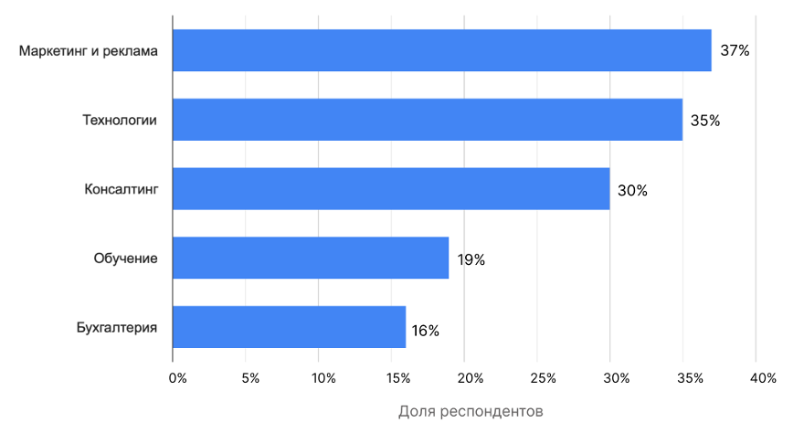

# Интеграция искусственного интеллекта в маркетинговые стратегии на примере стартапа Cosmic elaboration

***Аннотация:***

***Ключевые слова:*** *искусственный интеллект, маркетинг, интеграция
технологий, цифровая трансформация, анализ данных, реклама, технологии
предсказательной аналитики.*

### Введение 
В последние несколько лет отмечаются значительные трансформации в сфере
маркетинга и продаж, вызванные технологическими инновациями, которые
воздействуют на финансовое положение компаний. Экономические спады, насыщенные
рынки и цифровая трансформация стали ключевыми аспектами текущей деловой среды.
Привлечение клиентов становится сложным и ресурсоемким процессом, требующим
креативного и инновационного подхода. Организации вынуждены следовать за
трендами, интегрируя новые инструменты и технологии в свои производственные и
маркетинговые процессы.

Одним из эффективных решений, принимаемых руководителями, является использование
искусственного интеллекта (далее --- ИИ). ИИ позволяет предсказывать объемы
продаж компании, ускорять разработку новых товаров и увеличивать узнаваемость
бренда. Более того, ИИ способен снизить финансовые затраты на производство
благодаря доступности больших данных для анализа поведения покупателей и
принятия результативных бизнес-решений. Автоматизация рутинных задач также
уменьшает риск ошибок, связанных с человеческим фактором.

<!-- TODO: найти более свежую статистику -->
Согласно исследованию Dentons на 2022 год, ИИ активно используется 12% и
тестируется 48% крупных и средних компаний по всему миру[^1]. Немецкая компания,
специализирующаяся на рыночных и потребительский данных, Statista опубликовала в
2023 году статистику уровня внедрения ИИ в деятельность компаний США по
отраслям[^2]. 37% респондентов заявили, что активно применяют инструменты ИИ в
маркетинге и рекламе своей компании (рисунок 1). 

<!-- TODO: оформить ссылки по ГОСТу -->
[^1]: Искусственный интеллект применяют 60% крупных и средних компаний
https://www.vedomosti.ru/technology/articles/2022/01/12/904347-iskusstvennii-intellekt-primenyayut-60-kompanii

[^2]: Rate of generative AI adoption in the workplace in the United States 2023,
by industry https://www.statista.com/statistics/1361251/generative-ai-adoption-rate-at-work-by-industry-us/

 ***Рисунок 1.*** *Статистика уровня внедрения ИИ в
деятельность компаний США по отраслям в 2023 году*

В России процесс внедрения ИИ в бизнес только начинает набирать обороты. Опрос,
проведенный компанией "Авито Работа" среди представителей 300 бизнесов, показал,
что 32% компаний планируют внедрить решения ИИ в ближайшее время, а 55% из них
сосредотачивают внимание на маркетинге и продажах[^3].

<!-- TODO: оформить ссылку по ГОСТу -->
[^3]: Авито Работа: половина российских компаний готовы инвестировать 500
тыс.руб. во внедрение ИИ
https://www.avito.ru/company/press/vnedrenie-iskystvennogo-intellekta?ysclid=ls7828hkpm200412521

Хотя внедрение технологии ИИ в российский бизнес требует времени из-за
скептицизма предпринимателей, уже сейчас наблюдается явная польза от
использования ИИ в маркетинге при формировании стратегий, генерации контента и
персонализации предложений. Однако, вопрос о способности современной технологии
заменить работу маркетолога в создании продуктовой оболочки и привлечении
инвестиций остается открытым.

Цель настоящего исследования заключается в разработке концепции применения ИИ в
маркетинге стартапа для его успешного продвижения.

Среди задач исследования выделяются рассмотрение и разработка маркетинговых
элементов с использованием ИИ, определение влияния ИИ на эффективность
продвижения новых проектов с целью привлечения инвестиций. Объектом исследования
является коммерческое предприятие Cosmic elaboration, занимающееся космическими
разработками и созданием космической техники, а предметом --- особенности
воздействия ИИ на формирование маркетингового предложения данной компании.

### Результаты исследований 
Ученые Минг-Хуэй Хуанг и Рональд Раст определяют искусственный интеллект как
системы, которые реплицируют человеческий интеллект в цифровой форме,
предназначенные для имитации или превосходства человеческих способностей, таких
как осуществление механических или мыслительных задач. Цель ИИ — обучение,
рассуждение и выполнение задач. Однако, искусственный интеллект способен не
только обрабатывать данные для человеческого использования, но и обучаться на
предоставленной информации, автоматически обновляя результаты без необходимости
дополнительного программирования или вмешательства человека.

Основная функция маркетинга состоит в анализе потребностей клиентов,
сопоставлении их с предлагаемыми продуктами и услугами, а также стимулировании
убеждения людей в совершении покупок. Применение искусственного интеллекта
предоставляет значительные возможности для улучшения этих процессов. Таким
образом, маркетинг с использованием ИИ --- это стратегическое использование
автоматизированных систем и алгоритмов машинного обучения для оптимизации и
улучшения процессов в данной области.

Маркетинговый ИИ подразделяется согласно степени его интеллектуальных
возможностей на две категории: автоматизация задач и решение сложных задач с
использованием результатов машинного обучения.

Автоматизированные задачи включают в себя выполнение повторяющихся,
структурированных действий, для которых требуется относительно низкий уровень
интеллектуальных способностей. Подобные ИИ ограничены в решении сложных проблем,
таких как тонкости запросов клиентов. Примером программного обеспечения данной
категории может быть система, автоматически отправляющая приветственные
электронные письма каждому новому клиенту. В ходе основных взаимодействий оно
может оказать определенную помощь клиентам, однако не способно анализировать их
намерения, предоставлять индивидуальные ответы или улучшать свою
производительность на основе опыта со временем.

Методы машинного обучения находят способы использования обширных объемов данных
для формирования сложных прогнозов и принятия решений. Такие модели способны
распознавать и создавать изображения, анализировать и генерировать рекламный
текст, сегментировать клиентов и предсказывать реакции клиентов на различные
инициативы. Машинное обучение уже активно внедряется в области онлайн-рекламы,
систем рекомендаций в электронной коммерции и моделей склонности к продажам в
системах управления взаимоотношениями с клиентами (CRM). Вместе со своим более
сложным вариантом --- глубоким обучением, машинное обучение является ключевой
технологией в области ИИ и стремительно становится мощным инструментом в сфере
маркетинга.

В инновационной эпохе быстро меняющегося цифрового пейзажа использование ИИ в
маркетинге представляет собой существенный фактор, оказывающий воздействие не
только на корпоративных гигантов, но также на стартапы, только начинающие свою
деятельность. В свете этого, последние, подвергаясь постоянной конкуренции и,
имея неограниченный потенциал, обретают стратегическую значимость в быстро
эволюционирующем коммерческом окружении. Следовательно, они сталкиваются с
вопросами, имеющими определяющее значение для их долгосрочного успеха. Как
возможно выделиться в среде насыщенного рынка? Какие стратегии обеспечат
стойкость перед динамическими вызовами? И, прежде всего, как стартапы могут
активно способствовать инновационному развитию и устойчивому росту в современной
высококонкурентной среде предпринимательства?

Владельцы стартапов встают перед неизбежной нехваткой ресурсов, проблемами
масштабирования и сложностями, связанными с регулированием. Имея в виду эти
вызовы, применение ИИ обещает стать катализатором оптимизации и рационализации
операционной деятельности начинающих предприятий. 

Способности автоматизации, предиктивной аналитики и других аспектов ИИ
предлагают решения для эффективного распределения ресурсов в различных секторах
стартап-сферы. Тем самым, ИИ выполняет функцию преодоления пробелов в знаниях
ведения бизнеса, с которыми сталкиваются неопытные предприниматели, способствуя
успешному выходу их продуктов на рынок.

### Стартап Cosmic elaboration
В сфере ракетно-космической промышленности России сейчас наблюдается оживление.
Эта отрасль традиционно отнесена к области стратегически важных государственных
интересов. Так в апреле 2022 года была учреждена Аэрокосмическая инновационная
долина[^4]. Однако  отличительной чертой текущей попытки усиления активности в
разработке космических технологий является вмешательство российского частного
бизнеса в их исследования и коммерциализацию. Однако коммерческое освоение
космической деятельности находится на начальном этапе своего развития, поскольку
началось с опозданием по сравнению с Западом. А главная сложность, с которой
сталкиваются стартапы, заключается в длительном времени окупаемости инвестиций.

<!-- TODO: оформить ссылку по ГОСТу -->
[^4]: Постановление Правительства Российской Федерации No 735 от 22 апреля 2022
г. http://static.government.ru/media/files/NWVjGrBnS8AaSzgG6SSxCqM5JvpO2F5A.pdf

С технологической точки зрения за последнее десятилетие заметно возрос интерес к
активному изучению околоземных орбит. Перенаправление внимания на эти орбиты
раскрывает широкие перспективы для внедрения технологий, основанных на
высокоскоростной широкополосной связи с минимальной задержкой передачи данных.
Для полной реализации потенциала требуется решение нескольких проблем, включая
разработку, производство и налаживание массового выпуска спутниковых группировок
для различных задач, а также обеспечение их экономичного вывода на орбиту.

В данном контексте проявляются актуальные разработки, запланированные стартапом
[Cosmic elaboration](http://cosmicelaboration.ru/). Стартап нацелен на создание
многоразового воздушно-космического самолета с горизонтальным взлетом для
оказания коммерческих услуг по выведению полезной нагрузки на орбиту Земли и
возвращению нагрузки с орбиты на Землю. Стартап базируется на определенных
ноу-хау в области двигателей высокой тяги с рабочим процессом, основанным на
физике плазмы. Подобный двигатель предполагается сделать основой силовой
установки разрабатываемого воздушно-космического самолета. Созданию силовой
установки будет посвящен первый ключевой этап развития технологии
продолжительностью до двух лет, итогом которого станет макет двигателя с
подтвержденными в ходе испытаний характеристиками. Следующим ключевым этапом
станет создание опытного образца планера с интегрированным плазменным
двигателем, на что планируется потратить не менее одного года. Далее должен
последовать этап комплексных испытаний, корректировок и доработок системы, на
что, предположительно, потребуется около двух лет. 

Рассматриваемый проект характеризуется значительным уровнем рисков –--
технических, организационных, рыночных, а также рисков, связанных с поставками.
Их реализация может привести как к сдвигам в сроках разработки и производства,
так и к ограниченному финансированию. Учитывая подобные риски, реалистичный
временной горизонт для завершения проекта может составлять 7 лет и более, прежде
чем будет готов первый образец для предоставления коммерческих услуг по выводу
полезной нагрузки на орбиту.

### Создание рекламных материалов средствами ИИ
В настоящее время генеративный ИИ широко используется в процессе создания
контента, особенно в графическом дизайне, что представляет собой новаторский
подход, способствующий разработке уникальных и неожиданных визуальных концепций.

В контексте рассмотрения стартапа Cosmic elaboration визуальная составляющая
играет немаловажную роль в привлечении инвесторов. Эффективный дизайн и
привлекательный внешний вид могут быть ключевыми факторами в том, заинтересуется
ли инвестор проектом или нет: решение об этом принимается большинством из них на
основе первого визуального впечатления, поскольку качественный дизайн создает
ощущение профессионализма и надежности. Более того, хорошо продуманный дизайн
помогает ясно и наглядно передать суть продукта или услуги. Практически
мгновенное понимание того, как предложение решает определенную проблему или
удовлетворяет определенную потребность, является ключевым фактором, на который
нацелена любая рекламная компания.

Для создания логотипа стартапа Cosmic Elaboration были применены результаты
работы некоторых из лучших генеративных ИИ: DALL-E и Midiourney.
Указанные инструменты основаны на глубоких нейронных сетях, способных
обрабатывать текстовую информацию и преобразовывать ее в визуальные изображения,
и активно используются в деятельности ведущих компаний-гигантов, таких как
Cosmopolitan[^5] и Coca-Cola[^6].

<!-- TODO: оформить ссылки по ГОСТу -->
[^5]: Cosmopolitan использовал нейросеть для создания обложки журнала
https://snob.ru/news/cosmopolitan-ispolzoval-nejroset-dlya-sozdaniya-oblozhki-zhurnala/?ysclid=lsbu83qujz842765991

[^6]: Опыт Coca-Cola: как компания использует искусственный интеллект и Big Data
https://incrussia.ru/news/opyt-coca-cola-kak-kompaniya-ispolzuet-iskusstvennyj-intellekt-i-big-data/

<!-- TODO: добавить результаты генерации логотипа -->
<!-- TODO: написать часть про текстовое сопровождение + пример -->
<!-- TODO: написать часть про генерацию презентации + пример -->

<!-- TODO: скорректировать вывод из этой части -->
Таким образом, при правильном управлении человеком подобные нейронные сети
способны создавать привлекательные графические, текстовые и другие материалы,
которые передают основную миссию компании.

Однако следует помнить, что ИИ не является универсальным решением и полностью не
заменяет творческий подход маркетологов. Эффективное использование готовых
инструментов искусственного интеллекта требует сочетания технических знаний с
креативностью и пониманием потребностей организации.

### Анализ рынка и прогнозирование 
Бизнес-прогнозирование является критически важным инструментов, который
определяет финансовую рентабельность продукта и составляет стратегическое
планирование для принятие обоснованных решений. Для этих целей модели на основе
ИИ способны учитывать большое количество доступных факторов и давать достаточно
точный прогноз, выявляя тенденции, закономерности и корреляции при минимальном
участии пользователя, заполняя пробел в знаниях, с которыми часто сталкиваются
неопытные предприниматели и маркетологи.

Анализируя обширные наборы данных о динамике рынка, ИИ может подтвердить его
жизнеспособность, а также выявить потенциальные пробелы в планируемом продукте.
Используя методы обработки естественного языка, ИИ помогает стартапам
адаптировать их стратегии и  совершенствовать продукт или услугу для
удовлетворения потребностей рынка. 

В качестве эксперимента применения ИИ для анализа и прогнозирования в маркетинге
были рассмотрены следующие вопросы о стартапе Cosmic elaboration с
использованием генеративной предварительно обученной нейронной сети ChatGPT-4:

1. Определение ключевых преимуществ для их четкого понимания с целью выделения
   среди возможных конкурентов и привлечения внимания нужного клиента. 
2. Определение центральных источников инвестиций для финансирования разработки
   продукта, создания реалистичных планов развития и стратегических партнерств. 
3. Анализ целевой аудитории проекта для эффективного позиционирования и
   оптимизации маркетинговых стратегий. 
4. Прогнозирование основных рисков представленного проекта для предварительного
   выявления потенциальных проблем, минимизации убытков и  повышения способности
   проекта адаптироваться к изменениям.

Для взаимодействия с моделью ChatGPT-4 был разработан набор соответствующих
вопросов с предварительным описанием деятельности стартапа. Важно отметить, что
все вопросы были представлены в рамках одного сессионного обмена с нейросетью,
поскольку она имеет возможность поддерживать и использовать контекст предыдущих
запросов для генерации более информативных ответов на последующие вопросы. 

В [результате работы](forecasting.md) модель предоставила достаточно детальный
обзор конкурентных преимуществ, источников финансирования и потребительской
аудитории. В ответах отражаются реальные тенденции и возможности индустрии
космических технологий. Однако некоторые из них имеют обобщенный характер:
например, отсутствуют конкретные примеры организаций, успешно реализующих
предложенные преимущества для более наглядного представления о том, как они
могут быть осуществлены на практике. 

В целом, ответы нейронной сети представляют полезную информацию, но их
можно дополнить деталями для более глубокого понимания темы.

### Чат-боты с использованием ИИ
Использование компьютерных программ, которые способны имитировать человеческие
разговоры, становится все более популярным среди предпринимателей. Виртуальные
ассистенты, помощники и чат-боты на основе ИИ дают возможность автоматизировать
процесс взаимодействия с клиентами и потенциальными инвесторами, а также
обеспечить положительный опыт работы с ними, отвечая на часто задаваемые вопросы
и предлагая соответствующие решения, без необходимости привлечения
дополнительных человеческих ресурсов. 

<!-- TODO: добавить ссылки на статистику -->
В отличие от чат-ботов и голосовых меню, основанных на простых линейных
алгоритмах, системы, основанные на ИИ, могут решать задачи более высокой
сложности, недоступные для традиционных автоматизированных систем. Примером
такой технологии служит бот в <<Сбере>>, который за последний год повысил
скорость обработки обращений в банке на 3%. Его алгоритм транскрибирует речь,
тем самым позволяя более детально понимать извлекаемый смысл обращения. Другой
пример --- голосовой ассистент <<Почты России>>, который с помощью технологии
Yandex SpeechKit дает ответы голосом с интонациями, характерными для человека.
Бот позволил компании сократить расходы на 9,5 млн рублей во втором полугодии
2023 года, а также автоматизировал отслеживание  отправлений на 65%. 

Самыми большими преимуществами чат-ботов с ИИ для бизнеса являются: снижение
операционных и эксплуатационных расходов, масштабируемость, улучшение качества
обслуживания клиентов и повышение их вовлеченности, что обеспечивает высокий
процент конверсии и персонализированный клиентский опыт. Однако затраты на
разработку технологий, которые решают данные вопросы, могут быть непомерно
высокими. В таких случаях компании обращаются к специальным
платформам-конструкторам ботов с ИИ, например Pipe.bot и SAP Conversational AI. 

<!-- TODO: добавить ссылку на высказывание -->
Тем не менее, стоит понимать, что применении ИИ в чат-ботах в большинстве
случаев неоправданно для начинающего бизнеса, поскольку на старте проекта важно
фокусироваться именно на создании минимально жизнеспособного продукта, а не на
обработке отсутствующего большого оборота обращений. <<ИИ —-- инструмент
крупных корпораций уровня Apple и <<Яндекса>>>>, --— утверждает Капитон Смирнов,
CEO Popmechanic. 

Однако в контексте стартапов, чат-боты, оснащённые генеративными алгоритмами ИИ,
такие как ChatGPT, уже сейчас демонстрируют значительный потенциал для
применения в качестве инструментальных помощников на всех этапах развития
проекта, обеспечивая непрерывную поддержку, начиная с анализа целевой аудитории
и заканчивая формированием стратегий ведения переговоров.

### Отрицательные стороны использования ИИ в маркетинге стартапа 
Хотя использование ИИ может предложить стартапам множество преимуществ,
существует также ряд проблем, связанных с их внедрением в маркетинговые
стратегии, например:

- Зависимость от автоматизации. Важность творчества и человеческого взгляда в
  маркетинге, которые необходимы для настоящего вовлечения клиентов и
  инвесторов, неоспоримы, в связи с чем существует определенный риск, способный
  подавлять действительно инновационные идеи при избыточном использовании ИИ для
  реализации брендинга компании.  
- Непредсказуемые результаты. Алгоритмы ИИ способны генерировать результаты,
  которые могут оказаться неожиданными или несоответствующими первоначальным
  намерениям, особенно в аспектах прогнозирования потенциала на начальном этапе
  развития компании или в процессе формирования релевантной бизнес-модели. Это в
  свою очередь может привести к дисфункциональным последствиям для принятия
  ключевых маркетинговых стратегий, особенно когда инструментарий ИИ
  эксплуатируется сотрудниками, не обладающими достаточным уровнем компетенции.
- Недостаточная дифференциация предложения. В процессе эволюции и повышения
  доступности комплекса средств ИИ наблюдается тенденция к унификации
  маркетинговых стратегий, что влечет за собой угрозу снижения эффективности
  дифференциации продуктов стартапами на перенасыщенных рынках, приводя  к
  усилению конкуренции на основе цены, а не инноваций или качества.
- Риски безопасности. Системы ИИ обладают уязвимостью перед кибернетическими
  угрозами. Стартапы, интегрирующие функционал ИИ в маркетинговую стратегию,
  обязаны реализовать комплексные меры информационной безопасности для
  предотвращения утечек данных, последствия которых могут носить разрушительный
  характер для начинающего бизнеса как в финансовом аспекте, так и в контексте
  поддержания доверия со стороны клиентуры.

Это лишь некоторые из многих проблем, которые необходимо учитывать стартапам для
минимизации нежелательных последствий, тщательно подходя к внедрению ИИ в свои
маркетинговые стратегии.
