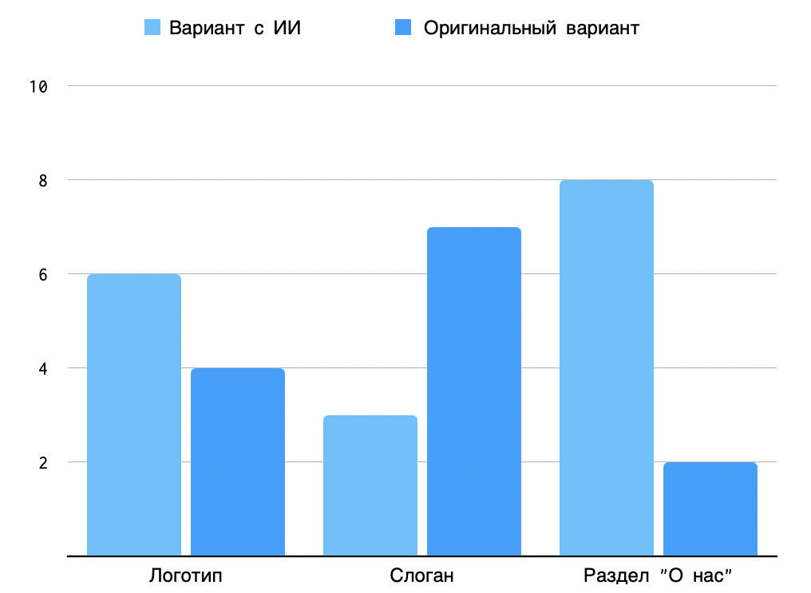

# Интеграция искусственного интеллекта в маркетинговые стратегии на примере стартапа Cosmic elaboration

***Аннотация:***

***Ключевые слова:*** *искусственный интеллект, маркетинг, интеграция
технологий, анализ данных, технологии предсказательной аналитики.*

### Введение 
В последние несколько лет отмечаются значительные изменения в сфере маркетинга и
продаж, вызванные технологическими инновациями, которые воздействуют на
финансовое положение компаний. Экономические спады, насыщенные рынки и цифровая
трансформация стали ключевыми аспектами текущей деловой среды. Привлечение
клиентов становится сложным и ресурсоемким процессом, требующим креативного и
инновационного подхода. Организации вынуждены следовать за трендами, интегрируя
новые инструменты и технологии в свои производственные и маркетинговые процессы.

Одним из эффективных решений, принимаемых руководителями, является использование
искусственного интеллекта (далее --- ИИ). ИИ позволяет предсказывать объемы
продаж компании, ускорять разработку новых товаров и увеличивать узнаваемость
бренда. Более того, ИИ способен снизить финансовые затраты на производство
благодаря доступности больших данных для анализа поведения покупателей и
принятия результативных бизнес-решений, а автоматизация рутинных задач уменьшает
риск ошибок, связанных с человеческим фактором.

Немецкая компания,специализирующаяся на рыночных и потребительский данных,
Statista опубликовала в 2023 году статистику уровня внедрения ИИ в деятельность
компаний США по отраслям[^1]. 37% респондентов заявили, что активно применяют
инструменты ИИ в маркетинге и рекламе своей компании (см. рисунок 1). 

[^1]: Rate of generative AI adoption in the workplace in the United States 2023,
by industry: [Электронный ресурс]. URL:
https://www.statista.com/statistics/1361251/generative-ai-adoption-rate-at-work-by-industry-us/

 **Рисунок 1.** Статистика уровня внедрения ИИ в
деятельность компаний США по отраслям в 2023 году

В России процесс внедрения ИИ в бизнес только начинает набирать обороты. Опрос,
проведенный компанией <<Авито Работа>> среди представителей 300 бизнесов,
показал, что 32% компаний планируют внедрить решения ИИ в ближайшее время, а 55%
из них сосредотачивают внимание на маркетинге и продажах[^2].

[^2]: Авито Работа: половина российских компаний готовы инвестировать 500
тыс.руб. во внедрение ИИ: [Электронный ресурс]. URL:
https://www.avito.ru/company/press/vnedrenie-iskystvennogo-intellekta?ysclid=ls7828hkpm200412521

Хотя внедрение технологии ИИ в российский бизнес требует времени из-за
скептицизма предпринимателей, уже сейчас наблюдается его польза от использования
в маркетинге при формировании стратегий, генерации контента и персонализации
предложений. Однако, вопрос о способности современной технологии заменить работу
маркетолога в создании продуктовой оболочки и привлечении инвестиций остается
открытым.

### Результаты исследований 
Ученые Минг-Хуэй Хуанг и Рональд Раст определяют ИИ как системы, которые
реплицируют человеческий интеллект в цифровой форме и предназначены для имитации
или превосходства человеческих способностей, таких как осуществление
механических или мыслительных задач[^3]. Цель ИИ --- обучение, рассуждение и
выполнение задач. Однако, ИИ способен не только обрабатывать данные для
человеческого использования, но и обучаться на предоставленной информации,
автоматически обновляя результаты без необходимости дополнительного
программирования или вмешательства человека.

[^3]: Хачатурян, К. С. Искусственный интеллект в маркетинге как новая концепция
    и бизнес-возможность для повышения эффективности компаний / К. С. Хачатурян,
    С. В. Пономарева, Н. В. Корюшов // Вестник евразийской науки. — 2023. — Т.
    15. — № 3. — URL: https://esj.today/PDF/55ECVN323.pdf

Основная функция маркетинга состоит в анализе потребностей клиентов,
сопоставлении их с предлагаемыми продуктами и услугами, а также стимулировании
убеждения людей в совершении покупок. Применение искусственного интеллекта
предоставляет значительные возможности для улучшения этих процессов. Таким
образом, маркетинг с использованием ИИ --- это стратегическое использование
автоматизированных систем и алгоритмов машинного обучения для оптимизации и
улучшения процессов в данной области.

Маркетинговый ИИ подразделяется согласно степени его интеллектуальных
возможностей на две категории: автоматизация задач и решение сложных задач с
использованием результатов машинного обучения.

Автоматизированные задачи включают в себя выполнение повторяющихся,
структурированных действий, для которых требуется относительно низкий уровень
интеллектуальных способностей. Подобные ИИ ограничены в решении сложных проблем,
таких как тонкости запросов клиентов. Примером программного обеспечения данной
категории может быть система, автоматически отправляющая приветственные
электронные письма каждому новому клиенту. В ходе основных взаимодействий оно
может оказать определенную помощь клиентам, однако не способно анализировать их
намерения, предоставлять индивидуальные ответы или улучшать со временем свою
производительность на основе опыта.

Методы машинного обучения находят способы использования обширных объемов данных
для формирования сложных прогнозов и принятия решений. Такие модели способны
распознавать и создавать изображения, анализировать и генерировать рекламный
текст, сегментировать клиентов и предсказывать реакции клиентов на различные
инициативы. Машинное обучение уже активно внедряется в области онлайн-рекламы,
системы рекомендаций в электронной коммерции, модели склонности к продажам в
системах управления взаимоотношениями с клиентами (CRM). Вместе со своим более
сложным вариантом --- глубоким обучением, машинное обучение является ключевой
технологией в области ИИ и стремительно становится мощным инструментом в сфере
маркетинга [^4].

[^4]: Jabeen M. The use of AI in marketing: Its impact and future // World
    Journal of Advanced Research and Reviews. — 2022. — №16(03). — С. 730-733. —
    URL: https://wjarr.com/sites/default/files/WJARR-2022-1419.pdf

В инновационной эпохе быстро меняющегося цифрового пейзажа использование ИИ в
маркетинге представляет собой существенный фактор, оказывающий воздействие не
только на корпоративных гигантов, но также на стартапы, только начинающие свою
деятельность. В свете этого, последние, подвергаясь постоянной конкуренции и,
имея неограниченный потенциал, обретают стратегическую значимость в быстро
эволюционирующем коммерческом окружении. Следовательно, они сталкиваются с
вопросами, имеющими определяющее значение для их долгосрочного успеха. 

Владельцы стартапов встают перед неизбежной нехваткой ресурсов, проблемами
масштабирования и сложностями, связанными с регулированием. Имея в виду эти
вызовы, применение ИИ обещает стать катализатором оптимизации и рационализации
операционной деятельности начинающих предприятий. 

Способности автоматизации, предиктивной аналитики и других аспектов ИИ
предлагают решения для эффективного распределения ресурсов в различных секторах
стартап-сферы. Тем самым, ИИ выполняет функцию преодоления пробелов в знаниях
ведения бизнеса, с которыми сталкиваются неопытные предприниматели, способствуя
успешному выходу их продуктов на рынок.

### Стартап Cosmic elaboration
В сфере ракетно-космической промышленности России сейчас наблюдается оживление.
Эта отрасль традиционно отнесена к области стратегически важных государственных
интересов. Так в апреле 2022 года была учреждена Аэрокосмическая инновационная
долина[^5]. Однако  отличительной чертой текущей попытки усиления активности в
разработке космических технологий является вмешательство российского частного
бизнеса в их исследования и коммерциализацию. Однако коммерческое освоение
космической деятельности находится на начальном этапе своего развития, поскольку
началось с опозданием по сравнению с Западом. А главная сложность, с которой
сталкиваются стартапы, заключается в длительном времени окупаемости инвестиций.

[^5]: Постановление Правительства Российской Федерации No 735 от 22 апреля 2022
г.: [Электронный ресурс]. URL:
http://static.government.ru/media/files/NWVjGrBnS8AaSzgG6SSxCqM5JvpO2F5A.pdf

Стартап [Cosmic elaboration](http://cosmicelaboration.ru/) нацелен на создание
многоразового воздушно-космического самолета с горизонтальным взлетом для
оказания коммерческих услуг по выведению полезной нагрузки на орбиту Земли и
возвращению нагрузки с орбиты на Землю. Стартап базируется на определенных
ноу-хау в области двигателей высокой тяги с рабочим процессом, основанным на
физике плазмы.

Данный проект сопряжен с высокими рисками: техническими, организационными,
рыночными, а также с рисками, связанными с поставками. Это может привести к
задержкам в разработке и производстве, а также к ограничениям в финансировании.
В свете указанных проблем, реалистичный срок завершения проекта и запуска
первого образца для коммерческой эксплуатации оценивается в 7 лет и более.

### Создание рекламных материалов средствами ИИ
В настоящее время генеративный ИИ широко используется в процессе создания
контента, особенно в графическом дизайне, что представляет собой новаторский
подход, способствующий разработке уникальных и неожиданных визуальных концепций.

В контексте рассмотрения стартапа Cosmic elaboration визуальная составляющая
играет немаловажную роль в привлечении инвесторов. Эффективный дизайн можкт быть
ключевым фактором в том, заинтересуется ли покупатель или инвестор проектом или
нет: решение об этом принимается большинством из них на основе первого
визуального впечатления, поскольку качественный брендинг создает ощущение
профессионализма и надежности. Более того, хорошо продуманный дизайн помогает
ясно и наглядно передать суть продукта или услуги.

Для создания логотипа стартапа Cosmic elaboration в работе представлены
результаты применения одних из лучших генеративных ИИ, Logo Creator GPT и LOGO
GPT, которые сочетают в себе аналитические возможности генеративной модели
ChatGPT и возможности создания визуальных концепций DALL-E. Указанные
инструменты активно применяемые в деятельности таких компаний-гигантов, как
Cosmopolitan[^6] и Сoca-Cola[^7].

[^6]: Cosmopolitan использовал нейросеть для создания обложки журнала:
[Электронный ресурс]. URL:
https://snob.ru/news/cosmopolitan-ispolzoval-nejroset-dlya-sozdaniya-oblozhki-zhurnala/?ysclid=lsbu83qujz842765991

[^7]: Опыт Coca-Cola: как компания использует искусственный интеллект и Big
Data: [Электронный ресурс]. URL:
https://incrussia.ru/news/opyt-coca-cola-kak-kompaniya-ispolzuet-iskusstvennyj-intellekt-i-big-data/

Для взаимодействия с моделями им был дан запрос с названием стартапа и кратким
описанием его деятельности. Logo Creator GPT перед генерацией изображения задаёт
дополнительные вопросы, которые позволяют будущему логотипу в большей степени
соответствовать ожиданиям пользователя, в то время как LOGO GPT создает
изображение без уточнений. 

Результаты работы Logo Creator GPT (см. рисунок 2) и LOGO GPT (см. рисунок 3)
были получены после большого количества попыток создать релевантные изображения.
В процессе возникало много ошибок, в большинстве случаев связанных с
неправильным отображением названия: отсутствовала какая-либо из букв, или слова
не имели смысла.

 **Рисунок 2.** Результат работы Logo Creator GPT для
создания логотипа

 **Рисунок 3.** Результат работы LOGO GPT для создания
логотипа

Создание слогана, описание миссии, видения и ценностей компании требует
глубокого анализа и понимания её ключевых преимуществ и целей на рынке. Такое
описание должно быть лаконичным и запоминающимся. Правильный слоган может помочь
сформировать мнение о начинающей компании и создать определенную эмоциональную
связь, будь то доверие или безопасность, что позволит четко идентифицировать
стартап среди конкурентов, повысить лояльность и привлечь новых клиентов и
заинтересованных инвесторов.

ИИ также предлагает инновационные инструменты для генерации подобного контента,
автоматизируя и отимизируя процесс. В контексте работы с текстом нейросети могут
сокращать и резюмировать большие объемы информации, проверять созданный материал
на ошибки, осуществлять переводы текстов на другие языки, разрабатывать с нуля
планы контент-маркетинга, статьи и слоганы.  С помощью ИИ маркетологи проводят
A/B тестирование различных версий текстовых материалов, чтобы определить, какие
из них наиболее эффективно взаимодействуют с аудиторией. 

В качестве примера использования ИИ для создания слогана и краткого описания
стартапа Cosmic elaboration используется специализированный вариант ChatGPT,
Write For Me, созданный для поддержки в написании текстов различных форматов и
стилей. Для взаимодействия с нейронной сетью запрос также содержал в себе
название и краткое описание деятельности стартапа. 

В результате нескольких попыток были выбраны наиболее подходящие и
структурированные ответы Write For Me (см. рисунок 4), по которым можно сделать
вывод, что ИИ достаточно хорошо справился с поставленной задачей. 

 **Рисунок 4.** Результат работы Write For Me для создания
слогана и краткого описания компании

В дополнение к уже рассмотренным методам применения ИИ в маркетинговых
стратегиях, специалисты также имеют возможность использовать алгоритмы для
автоматизации создания рекламных баннеров, разработки презентаций и оформления
веб-сайтов для транслирования ключевых идей проекта. 

Для определения эффективности применения инструментов ИИ для стартапа Cosmic
elaboration был проведен опрос среди десяти специалистов в области маркетинга.
Каждому из респондентов было предложено сделать выбор о привлекательности и
релевантности двух вариантов логотипа, слогана и краткой презентации стартапа,
один из которых создан средствами ИИ, другой --- маркетологом компании. 

По результатам опроса (см. рисунок 5) можно сделать вывод, что ИИ достаточно
хорошо справился с поставленными задачами, однако следует помнить, что он не
является универсальным решением и не заменяет творческий подход маркетологов:
только при правильном управлении человеком подобные нейронные сети способны
создавать привлекательные графические, текстовые и другие виды материалов.
Эффективное использование готовых инструментов ИИ требует сочетания технических
знаний с профессиональными навыками и пониманием потребностей организации.

 **Рисунок 5.** Результат опроса маркетологов для
сравнения оригинальных решений и решений, полученных с помощью ИИ

### Чат-боты с использованием ИИ
Использование компьютерных программ, которые способны имитировать человеческие
разговоры, становится все более популярным среди предпринимателей. Виртуальные
ассистенты, помощники и чат-боты на основе ИИ дают возможность автоматизировать
процесс взаимодействия с клиентами и потенциальными инвесторами, а также
обеспечить положительный опыт работы с ними, отвечая на часто задаваемые вопросы
и предлагая соответствующие решения, без необходимости привлечения
дополнительных человеческих ресурсов. 

В отличие от чат-ботов и голосовых меню, основанных на простых линейных
алгоритмах, системы, основанные на ИИ, могут решать задачи более высокой
сложности, недоступные для традиционных автоматизированных систем. Примером
такой технологии служит бот в <<Сбере>>, который за последний год повысил
скорость обработки обращений в банке на 3%. Его алгоритм транскрибирует речь,
тем самым позволяя более детально понимать извлекаемый смысл обращения. Другой
пример --- голосовой ассистент <<Почты России>>, который с помощью технологии
Yandex SpeechKit дает ответы голосом с интонациями, характерными для человека.
Бот позволил компании сократить расходы на 9,5 млн рублей во втором полугодии
2023 года, а также автоматизировал отслеживание отправлений на 65%[^8]. 

[^8]: Фантастические данные о чат-ботах за 2023 год: [Электронный ресурс]. URL:
https://vc.ru/marketing/935439-fantasticheskie-dannye-o-chat-botah-za-2023-god?ysclid=ltlpy64mkj828628615

Самыми большими преимуществами чат-ботов с ИИ для бизнеса являются: снижение
операционных и эксплуатационных расходов, масштабируемость, улучшение качества
обслуживания клиентов и повышение их вовлеченности, что обеспечивает высокий
процент конверсии и персонализированный клиентский опыт. Однако затраты на
разработку технологий, которые решают данные вопросы, могут быть непомерно
высокими. В таких случаях компании обращаются к специальным
платформам-конструкторам ботов с ИИ, например Pipe.bot и SAP Conversational AI. 

Тем не менее, стоит понимать, что применении ИИ в чат-ботах в большинстве
случаев неоправданно для начинающего бизнеса, поскольку на старте проекта важно
фокусироваться именно на создании минимально жизнеспособного продукта, а не на
обработке отсутствующего большого оборота обращений. <<ИИ —-- инструмент крупных
корпораций уровня Apple и <<Яндекса>>>>, --— утверждает Капитон Смирнов, CEO
Popmechanic. 

Однако в контексте стартапов, чат-боты, оснащённые генеративными алгоритмами ИИ,
такие как ChatGPT, уже сейчас демонстрируют значительный потенциал для
применения в качестве инструментальных помощников на всех этапах развития
проекта, обеспечивая непрерывную поддержку, начиная с анализа целевой аудитории
и заканчивая формированием стратегий ведения переговоров.

### Анализ рынка и прогнозирование 
Бизнес-прогнозирование является критически важным инструментов, который
определяет финансовую рентабельность продукта и составляет стратегическое
планирование для принятие обоснованных решений. Для этих целей модели на основе
ИИ способны учитывать большое количество доступных факторов и давать достаточно
точный прогноз, выявляя тенденции, закономерности и корреляции при минимальном
участии пользователя, заполняя пробел в знаниях, с которыми часто сталкиваются
неопытные предприниматели и маркетологи.

Анализируя обширные наборы данных о динамике рынка методами обработки
естественного языка, ИИ может подтвердить его жизнеспособность, а также выявить
потенциальные пробелы в планируемом продукте.

В качестве эксперимента применения ИИ для анализа и прогнозирования в маркетинге
были рассмотрены следующие вопросы о стартапе Cosmic elaboration с
использованием генеративной предварительно обученной нейронной сети ChatGPT-4:
1. Определение ключевых преимуществ. 
2. Определение центральных источников инвестиций для финансирования разработки
   продукта. 
3. Анализ целевой аудитории проекта для оптимизации маркетинговых стратегий. 
4. Прогнозирование основных рисков.

Для взаимодействия с моделью ChatGPT-4 был разработан набор соответствующих
вопросов с предварительным описанием деятельности стартапа. Важно отметить, что
все вопросы были представлены в рамках одного сессионного обмена с нейросетью,
поскольку она имеет возможность поддерживать и использовать контекст предыдущих
запросов для генерации более информативных ответов. 

В [результате работы](forecasting.md) модель предоставила достаточно детальный
обзор конкурентных преимуществ, источников финансирования и потребительской
аудитории. В ответах отражаются реальные тенденции и возможности индустрии
космических технологий.

### Отрицательные стороны использования ИИ в маркетинге стартапа 
Хотя использование ИИ может предложить стартапам множество преимуществ,
существует также ряд проблем, связанных с их внедрением в маркетинговые
стратегии, например:

- Зависимость от автоматизации: существует определенный риск, связанные с
  возможностью подавления действительно инновационных идей при избыточном
  использовании ИИ для реализации брендинга компании.  
- Непредсказуемые результаты: алгоритмы ИИ способны генерировать результаты,
  которые могут не соответствовать первоначальным намерениям, что в свою очередь
  приведет к дисфункциональным последствиям для принятия ключевых маркетинговых
  стратегий, особенно когда инструментарий ИИ эксплуатируется сотрудниками, не
  обладающими достаточным уровнем компетенции.
- Недостаточная дифференциация предложения: в процессе эволюции и повышения
  доступности комплекса средств ИИ наблюдается тенденция к унификации
  маркетинговых стратегий, что влечет за собой угрозу снижения эффективности
  дифференциации продуктов стартапами на перенасыщенных рынках, приводя  к
  усилению конкуренции на основе цены, а не инноваций или качества.
- Риски безопасности: системы ИИ обладают уязвимостью перед кибернетическими
  угрозами. Стартапы, интегрирующие функционал ИИ в маркетинговую стратегию,
  обязаны реализовать комплексные меры информационной безопасности для
  предотвращения утечек данных, последствия которых могут носить разрушительный
  характер для начинающего бизнеса как в финансовом аспекте, так и в контексте
  поддержания доверия со стороны клиентуры.

Это лишь некоторые из возможных проблем, которые необходимо учитывать компаниям
для минимизации нежелательных последствий, тщательно подходя к внедрению ИИ в
свои маркетинговые стратегии.

### Заключение 
Хотя маркетинг, основанный на применении ИИ, предоставляет множество перспектив
и преимуществ, таких как преодоление ограниченности ресурсов, высокая
дифференциация в условиях конкуренции, масштабируемость и предоставление
необходимой информации для принятия обоснованных решений, предпринимателям
следует реалистично оценивать его текущие возможности. Важно понимать, что
нейронные сети могут эффективно решать задачи только под руководством
квалифицированных специалистов, служа инструментом для облегчения и ускорения
рабочих процессов.

При интеграции ИИ компании необходимо четко определять бизнес-задачи,
формировать подходящую команду, подготавливать качественные данные для обучения,
а также тестировать и проверять эффективность полученных решений. Успех
внедрения ИИ часто определяется конкретным контекстом и спецификой бизнеса, при
этом гибкость и способность к адаптации остаются ключевыми качествами в
постоянно изменяющемся мире.
